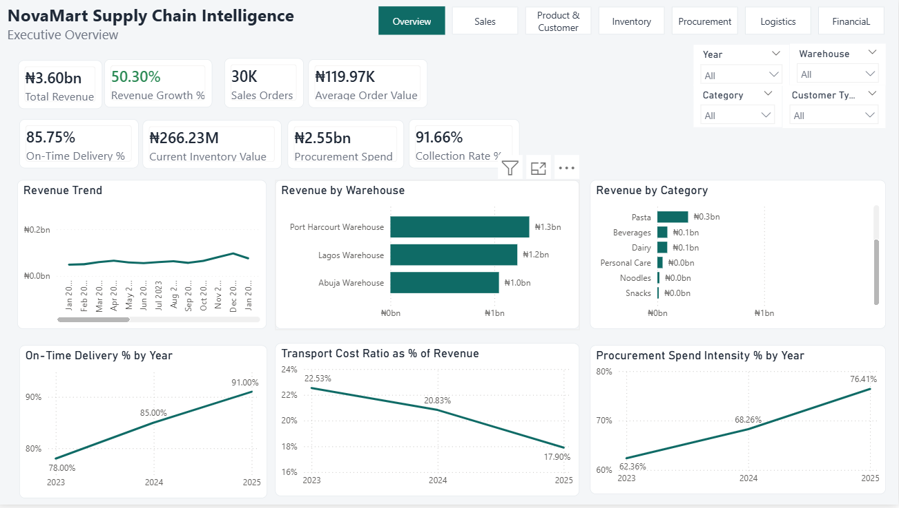
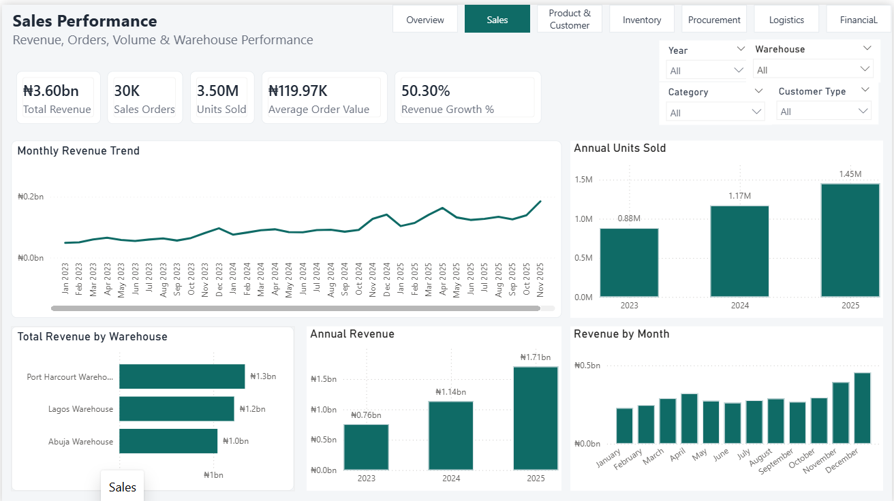
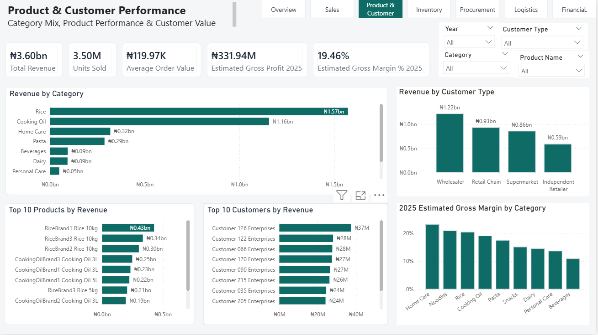
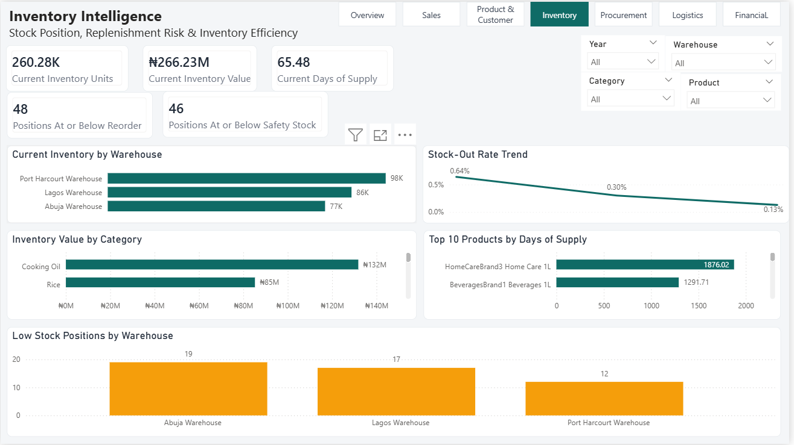
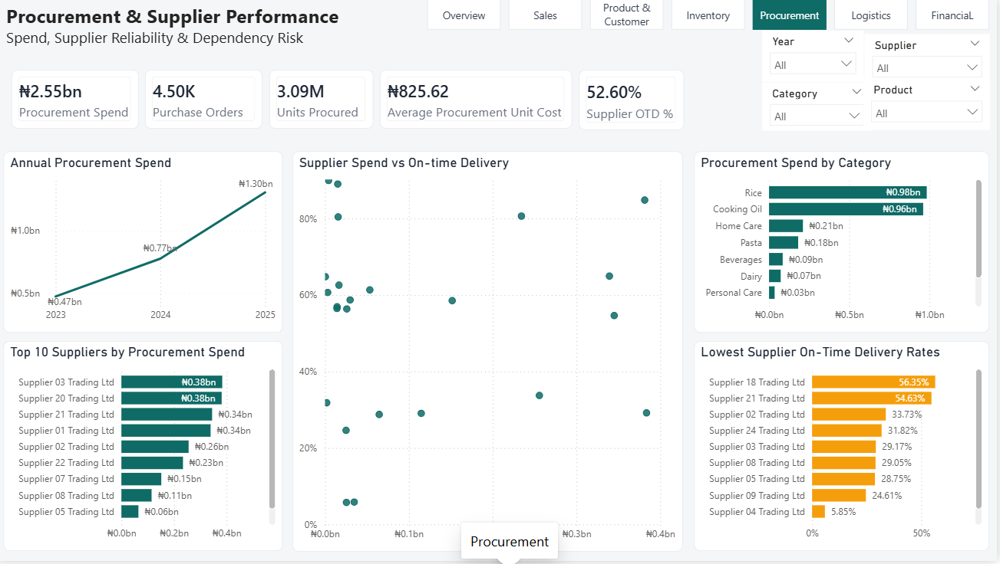
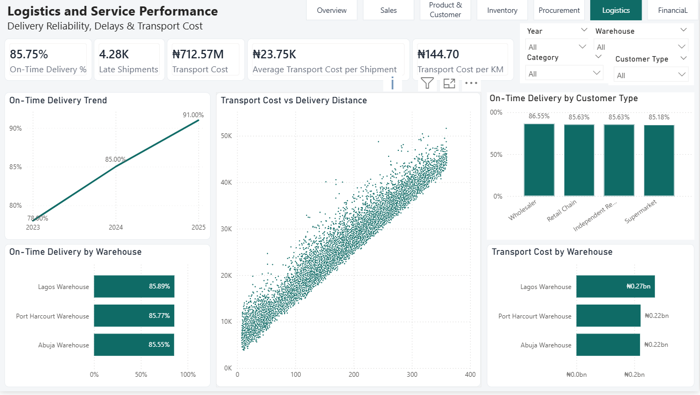
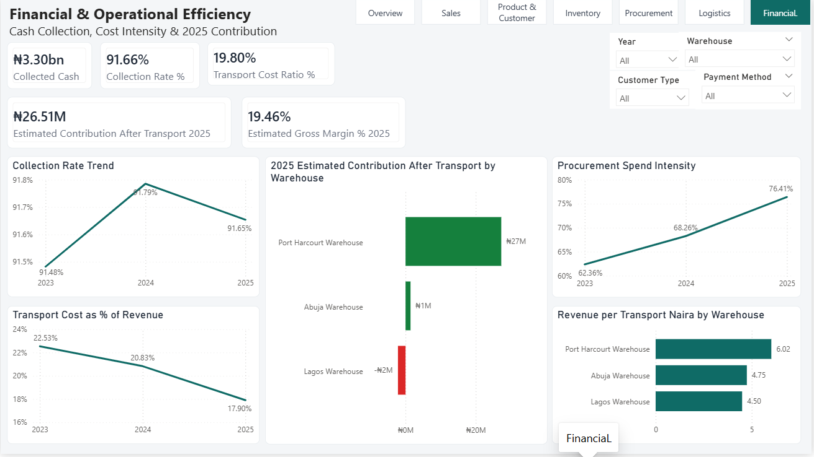

# NovaMart Supply Chain Intelligence

### End-to-End Supply Chain Analytics for a Simulated National FMCG Distributor

NovaMart Supply Chain Intelligence is an end-to-end business intelligence project designed to evaluate how effectively a simulated national FMCG distributor converts procurement, inventory, warehouse, sales, logistics, and financial activity into reliable customer service and sustainable business performance.

The project combines **MySQL, SQL, DAX, and Power BI** to analyze performance across sales, products, customers, inventory, procurement, supplier reliability, logistics, cash collection, and operational efficiency.

The final solution includes a validated relational database, six modular SQL analysis workstreams, a governed KPI framework, and a seven-page interactive Power BI dashboard.

## Business Problem

NovaMart operates across Lagos, Abuja, and Port Harcourt, serving supermarkets, wholesalers, retail chains, and independent retailers across nine FMCG product categories.

As the business grows, management needs a clear view of whether increasing sales are translating into stronger operational performance. Key concerns include procurement cost pressure, supplier reliability, inventory imbalance, delivery performance, transport efficiency, cash collection, and contribution after transport.

The project therefore addresses the central business question:

> **How effectively does NovaMart convert procurement, inventory, warehouse, sales, logistics, and financial activity into profitable and reliable customer service?**

## Project Objective

The objective of the project is to transform operational data into decision-ready insights by identifying:

- revenue and demand trends
- product and customer concentration
- inventory availability and replenishment risk
- procurement cost pressure
- supplier reliability and dependency
- logistics service performance
- transport cost efficiency
- cash collection performance
- estimated profitability and contribution
- warehouse-level operating differences

- ## Key KPIs

The dashboard is built around a governed set of executive and operational KPIs, including:

### Commercial Performance
- Total Revenue
- Revenue Growth %
- Sales Orders
- Units Sold
- Average Order Value

### Inventory
- Current Inventory Units
- Current Inventory Value
- Stock-Out Rate %
- Positions At or Below Reorder
- Positions At or Below Safety Stock
- Current Days of Supply

### Procurement
- Procurement Spend
- Purchase Orders
- Units Procured
- Average Procurement Unit Cost
- Supplier On-Time Delivery %

### Logistics
- Shipments Count
- On-Time Delivery %
- Late Shipments
- Transport Cost
- Average Transport Cost per Shipment
- Transport Cost per Kilometer
- Transport Cost Ratio

### Financial & Operational Efficiency
- Collected Cash
- Collection Rate %
- Procurement Spend Intensity %
- Estimated Gross Margin % 2025
- Estimated Contribution After Transport 2025
- Estimated Contribution Margin % 2025
- Revenue per Transport Naira
- 
## Dashboard Preview

### Executive Overview



The complete Power BI report contains seven interactive analytical pages covering sales, products and customers, inventory, procurement, logistics, and financial efficiency.

- ## Key Business Insights

### 1. Revenue growth is strong, but procurement pressure is increasing

Revenue increased from approximately **₦757.77M in 2023 to ₦1.706B in 2025**, while procurement spend grew even faster.

Procurement spend intensity increased from **62.36% of revenue in 2023 to 76.41% in 2025**, indicating growing pressure on margin as the business scales.

### 2. Rice and Cooking Oil dominate commercial performance

Rice contributes approximately **43.69% of total revenue**, while Cooking Oil contributes around **32.12%**.

Together, they account for about **75.8% of total revenue**, creating both commercial strength and concentration risk.

### 3. Supplier reliability is a major operational risk

Overall supplier on-time delivery is approximately **52.6%**.

Some high-spend suppliers also have weak reliability. For example, Supplier03 accounts for approximately **₦383.56M in procurement spend** but records only about **29.17% on-time delivery**.

### 4. Stock availability improved, but inventory imbalance remains

Stock-out rate improved from approximately:

- **0.64% in 2023**
- **0.30% in 2024**
- **0.13% in 2025**

However, the current inventory snapshot still contains:

- **48 positions at or below reorder level**
- **46 positions at or below safety stock**

At the same time, some products hold very high days of supply, indicating imbalance between excess and low-stock positions.

### 5. Logistics service performance improved substantially

On-time delivery increased from:

- **78% in 2023**
- **85% in 2024**
- **91% in 2025**

At the same time, transport cost as a percentage of revenue declined from approximately **22.53% to 17.90%**.

Delivery distance is the strongest observable transport-cost driver in the dataset.

### 6. Port Harcourt currently shows the strongest warehouse economics

Port Harcourt generated approximately **₦1.335B in revenue** and produced the strongest 2025 estimated contribution after transport at about **₦27.26M**.

Lagos recorded an estimated contribution after transport of approximately **-₦2.16M** in 2025, indicating a need for deeper cost-to-serve analysis.

### 7. Cash collection is strong, but post-transport contribution remains thin

NovaMart collected approximately **91.66% of recorded revenue**.

For 2025, estimated gross margin was approximately **19.46%**, while estimated contribution after transport was about **₦26.51M**, equivalent to approximately **1.55% of revenue**.

This shows that strong sales growth does not automatically translate into equally strong post-transport contribution.

### 8. Customer segments contribute value differently

Wholesalers generated the highest total customer-segment revenue at approximately **₦1.217B**.

Retail Chains recorded the highest average order value at approximately **₦310K**, while Independent Retailers placed a larger number of lower-value orders.

This suggests that customer segments should not be managed using a single service model.

## Management Recommendations

Based on the analysis, five management priorities emerge:

1. **Control procurement cost growth**  
   Strengthen supplier negotiations, purchasing discipline, and category-level cost monitoring.

2. **Reduce supplier reliability risk**  
   Introduce supplier scorecards, corrective-action reviews, service-level targets, and alternative sourcing for high-risk suppliers.

3. **Improve inventory balance**  
   Manage replenishment at product-warehouse level using demand velocity, safety stock, reorder levels, and days of supply.

4. **Strengthen cost-to-serve management**  
   Compare warehouse, route, shipment, and customer economics to identify where operating costs can be reduced.

5. **Protect margin as the business scales**  
   Monitor procurement cost, transport efficiency, product mix, and customer economics alongside revenue growth.

   ## Executive Takeaway

> **NovaMart is growing strongly and delivering more reliably, but the next stage of improvement should focus on converting that growth into stronger, more resilient, and more profitable operations.**
>
> ## Tools & Technologies

The project was built using the following tools:

- **MySQL 8.0+** — relational database design, data storage, validation, and analytical querying
- **MySQL Workbench** — SQL development, testing, reconciliation, and result inspection
- **Power BI Desktop** — semantic modeling, DAX measures, dashboard development, drill-through, tooltips, and interactive reporting
- **DAX** — governed KPI and analytical measure development
- **Power Query** — data type checks and model preparation
- **ODBC / MySQL Connector** — connection between MySQL and Power BI
- **Microsoft Excel** — supporting validation and comparison of analytical outputs
- **CSV** — dataset loading and interchange format

- ## Technical Architecture

NovaMart was designed as a layered analytical solution:

1. **Operational Data Layer**  
   A MySQL relational database containing validated operational and master data.

2. **SQL Analysis Layer**  
   Six modular SQL workstreams used to calculate KPIs, trends, rankings, diagnostics, and reconciliation outputs.

3. **Semantic / KPI Layer**  
   Power BI imports the relational model and applies governed DAX measures for interactive analysis.

4. **Presentation Layer**  
   A seven-page Power BI dashboard presents executive and operational insights through KPI cards, trends, rankings, slicers, drill-through pages, and tooltips.

The end-to-end architecture is:

> **MySQL Database → SQL Analysis → Power BI Data Model → DAX Measures → Interactive Dashboard**
>
> ## Dataset Overview

The project uses a simulated FMCG operational dataset created specifically for portfolio analysis.

The validated production dataset contains 14 relational tables covering master data, procurement, sales, logistics, finance, and inventory.

### Dataset Scale

- 9 product categories
- 24 suppliers
- 90 products
- 3 warehouses
- 600 customers
- 120 employees
- 4,500 purchase orders
- 14,023 purchase-order items
- 30,000 sales orders
- 150,000 sales-order items
- 30,000 shipments
- 30,000 payment records
- 197,854 inventory transactions
- 270 current inventory positions

- ## Data Model

The 14 production tables are grouped into the following areas:

### Master Data
- Categories
- Suppliers
- Products
- Warehouses
- Customers
- Employees

### Procurement
- PurchaseOrders
- PurchaseOrderItems

### Sales
- SalesOrders
- SalesOrderItems

### Logistics
- Shipments

### Finance
- Payments

### Inventory
- InventoryTransactions
- Inventory

A dedicated Date table is used in Power BI to support controlled historical analysis across the relevant transactional dates.

## SQL Analysis Modules

The analytical workload was organized into six modular SQL files, each aligned to a specific business workstream.

1. **Sales Performance**  
   `01_sales_performance.sql`  
   Covers revenue, orders, units sold, average order value, growth trends, monthly performance, and warehouse sales contribution.

2. **Product & Customer Performance**  
   `02_product_customer_performance_v1.1.sql`  
   Covers category performance, product performance, customer segments, top customers, revenue concentration, and 2025 estimated profitability.

3. **Inventory Intelligence**  
   `03_inventory_intelligence_v1.0.sql`  
   Covers current inventory, stock-out rates, reorder exposure, safety stock, days of supply, inventory turnover, and inventory concentration.

4. **Procurement & Supplier Performance**  
   `04_procurement_supplier_v1.0.sql`  
   Covers procurement spend, units procured, supplier concentration, supplier on-time delivery, and dependency risk.

5. **Logistics & Service Performance**  
   `05_logistics_service_v1.0.sql`  
   Covers shipment activity, on-time delivery, delivery delays, transport cost, warehouse logistics performance, and cost drivers.

6. **Financial & Operational Efficiency**  
   `06_financial_operational_efficiency_v1.1.sql`  
   Covers cash collection, procurement intensity, transport cost ratio, payment performance, estimated gross margin, contribution after transport, and warehouse efficiency.

Each module includes reconciliation checks to ensure analytical outputs remain consistent with the underlying source data.

## Power BI Dashboard

The final Power BI solution contains seven main analytical pages.

### 1. Executive Overview
Provides a high-level view of the most important commercial, operational, and financial KPIs.

Key measures include:
- Total Revenue
- Revenue Growth %
- Sales Orders
- Average Order Value
- On-Time Delivery %
- Current Inventory Value
- Procurement Spend
- Collection Rate %

### 2. Sales Performance
Focuses on revenue growth, order activity, unit demand, monthly trends, and warehouse performance.

### 3. Product & Customer Performance
Analyzes category mix, top products, customer segments, customer concentration, and 2025 estimated gross margin.

### 4. Inventory Intelligence
Examines current inventory position, stock-out trends, low-stock exposure, days of supply, and inventory concentration.

### 5. Procurement & Supplier Performance
Evaluates procurement spend, supplier concentration, supplier reliability, category spend, and high-risk suppliers.

### 6. Logistics & Service Performance
Tracks on-time delivery, late shipments, transport cost, warehouse service performance, customer-segment service levels, and delivery-distance cost relationships.

### 7. Financial & Operational Efficiency
Connects collections, procurement intensity, transport cost, estimated profitability, warehouse contribution, and operational efficiency.

<p align="center">
  
  
</p>

<p align="center">
  
  
</p>

<p align="center">
  
  
</p>

## Dashboard Interactivity

The report includes:

- synchronized slicers across relevant pages
- Year, Warehouse, Category, Customer Type, Supplier, Product, and Payment Method filters
- Product drill-through analysis
- Supplier drill-through analysis
- Product tooltip pages
- page navigation across all seven main dashboards
- controlled filter interactions
- current-state inventory measures separated from historical year-based analysis

- ## Validation & Quality Assurance

The NovaMart project used a multi-stage validation process to ensure that dashboard outputs remained consistent with the underlying data and SQL analysis.

Validation included:

- source-table row-count checks
- referential integrity checks
- duplicate and key-field validation
- reconciliation of revenue, procurement, shipment, payment, and inventory metrics
- SQL-to-DAX KPI reconciliation
- relationship and filter-context testing in Power BI
- drill-through and tooltip testing
- page-by-page dashboard QA

Major Power BI measures were reconciled against validated SQL outputs before the dashboard was frozen as the final v1.0 portfolio release.

The final Stock-Out Rate trend was also validated at yearly level after correcting the Date-to-InventoryTransactions relationship, producing approximately:

- **2023: 0.64%**
- **2024: 0.30%**
- **2025: 0.13%**

- ## Detailed Documentation

Additional project documentation is available in the `docs/` directory:

- [Executive Summary](docs/executive-summary.md)
- [Business Insights & Recommendations](docs/business-insights.md)
- [Technical Documentation](docs/technical-documentation.md)
- [Data Dictionary](docs/data-dictionary.md)

- ## Repository Structure

```text
novamart-supply-chain-intelligence/
│
├── README.md
├── LICENSE
├── .gitignore
│
├── docs/
│   ├── executive-summary.md
│   ├── business-insights.md
│   ├── technical-documentation.md
│   └── data-dictionary.md
│
├── sql/
│   ├── 01_sales_performance.sql
│   ├── 02_product_customer_performance_v1.1.sql
│   ├── 03_inventory_intelligence_v1.0.sql
│   ├── 04_procurement_supplier_v1.0.sql
│   ├── 05_logistics_service_v1.0.sql
│   └── 06_financial_operational_efficiency_v1.1.sql
│
├── dashboard/
│   ├── NovaMart_Supply_Chain_Intelligence_v1.0.pbix
│   └── screenshots/
│       ├── 01_executive_overview.png
│       ├── 02_sales_performance.png
│       ├── 03_product_customer_performance.png
│       ├── 04_inventory_intelligence.png
│       ├── 05_procurement_supplier_performance.png
│       ├── 06_logistics_service_performance.png
│       └── 07_financial_operational_efficiency.png
│
├── data/
│   └── README.md
│
└── assets/
    └── README.md


Then add:

```markdown
## Project Limitations

The project was built for portfolio and analytical demonstration purposes using a simulated FMCG dataset.

Key limitations include:

- the company and operational data are simulated rather than sourced from a live commercial system
- historical profitability analysis is limited because current product Standard Cost cannot reliably represent prior-year cost conditions
- 2025 profitability metrics are therefore reported as estimates
- Estimated Contribution After Transport is not equivalent to operating profit or net profit
- current inventory metrics represent a present-state snapshot rather than a historical inventory balance by year
- transport-cost allocation was not forced onto categories where the available data did not provide a defensible allocation basis
- findings should therefore be interpreted within the analytical assumptions and scope of the simulated dataset

## Skills Demonstrated

This project demonstrates practical experience in:

- relational database design
- SQL analysis and reconciliation
- data validation and quality assurance
- KPI definition and governance
- DAX measure development
- Power BI semantic modeling
- time intelligence and filter context
- dashboard design and interactivity
- supply chain analytics
- inventory analysis
- procurement and supplier analysis
- logistics and transport-cost analysis
- customer and product performance analysis
- financial and operational efficiency analysis
- business storytelling and executive reporting

## Portfolio Positioning

## Portfolio Positioning

NovaMart demonstrates an end-to-end analytical workflow from relational database design and SQL analysis through Power BI modeling, validation, and business recommendation development.

The project was designed to demonstrate not only dashboard development, but the ability to translate operational data into governed, decision-ready business intelligence.

## How to Use This Repository

- Review the main `README.md` for the project overview, business problem, key findings, and recommendations.
- Open the `sql/` folder to inspect the six final analytical SQL modules.
- Open `docs/` for the executive summary, technical documentation, business insights, and data dictionary.
- Open `dashboard/screenshots/` to view the seven Power BI report pages.
- Open the `.pbix` file in Power BI Desktop to explore the full interactive dashboard where supported.

## Author

**Michael Shode**

Supply Chain & Logistics Analytics | Data Analytics | Business Intelligence

Interested in applying data, analytics, and technology to supply chain, logistics, inventory, and operational decision-making.

## Project Status

**Status:** Complete  
**Release:** v1.0

The current release includes:

- validated MySQL data model
- six final SQL analysis modules
- governed Power BI KPI framework
- seven-page interactive Power BI dashboard
- drill-through and tooltip analysis
- SQL-to-DAX reconciliation
- executive insights and recommendations
- technical documentation
